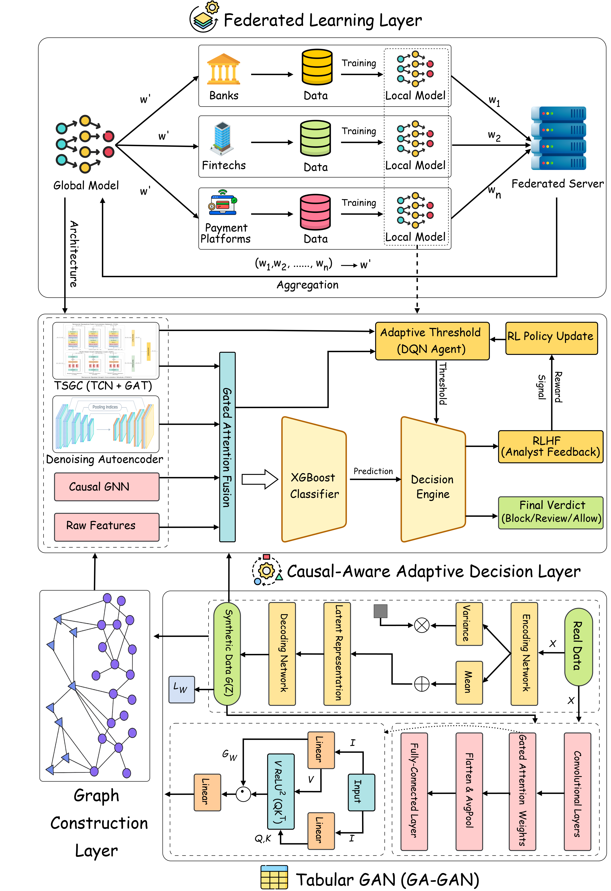

# U-FIN: A Federated Generative Learning with RL-Tuned Dual-Stream Networks (TCN-GAT) for Real-Time Financial Fraud Detection

> **Paper:** [Include full citation after publication]  
> **Dataset:** [IEEE-CIS Fraud Detection](https://www.kaggle.com/competitions/ieee-fraud-detection/data) (Kaggle)  
> **Results:** AUC 0.9607 | F1 0.7557 | Accuracy 0.9844 | Specificity 0.9951

---

## Overview

U-FIN is a multi-model fraud detection framework that combines heterogeneous deep learning encoders through a novel Gated Attention Fusion (GAF) mechanism. The architecture consists of:

- **Temporal Stream — TCN**: Temporal Convolutional Network capturing longitudinal behavioral patterns from sequential transaction data
- **Graph Stream — GAT**: Graph Attention Network encoding relational structure within and across account neighborhoods
- **Graph Stream — CaT-GNN**: Causal Temporal GNN applying causal intervention to suppress spurious graph correlations
- **Gated Attention Fusion (GAF)**: Per-sample adaptive weighting of all three 64-dimensional encoder outputs
- **XGBoost Meta-Learner**: Final classifier trained on the 327-dimensional fused + tabular feature vector

The system is further extended with:
- **GA-GAN**: Generative Attention GAN (VAE generator + CNN-Attention discriminator) for class-imbalance augmentation
- **DQN-RL + RLHF**: Deep Q-Network agent for adaptive decision routing with analyst-in-the-loop feedback
- **Federated Learning**: FedAvg with differential privacy across Banks, Fintechs, and Payment Platforms

---

## Architecture



The three-tier architecture diagram shows:
- **Top tier**: Federated training across institutions (Banks, Fintechs, Payment Platforms) with FedAvg aggregation
- **Middle tier**: Dual-stream encoding → Gated Attention Fusion → XGBoost → DQN Decision Engine
- **Bottom tier**: GA-GAN (VAE + CNN-Attention) for synthetic fraud augmentation

---

## Repository Structure

```
U-FIN/
│
├── Final_notebooks/
│   ├── training_tcn.ipynb          # Notebook 1: TCN temporal encoder
│   ├── training_gat.ipynb          # Notebook 2: GAT graph encoder
│   ├── training_catgnn.ipynb       # Notebook 3: CaT-GNN causal graph encoder
│   └── training_fusion.ipynb       # Notebook 4: Gated Fusion + XGBoost (full pipeline)
│
├── Final_Architecture.png            # Full system architecture diagram
├── README.md                         # This file
│
└── data/                             # Create this folder manually (see Dataset section)
    ├── train_transaction.csv         # Download from Kaggle
    ├── train_identity.csv            # Download from Kaggle
    ├── test_transaction.csv          # Download from Kaggle
    └── test_identity.csv             # Download from Kaggle
```

---

## Dataset

The IEEE-CIS Fraud Detection dataset is hosted on Kaggle and **cannot be redistributed**. To obtain it:

1. Create a Kaggle account at [kaggle.com](https://www.kaggle.com)
2. Accept the competition rules at: [https://www.kaggle.com/competitions/ieee-fraud-detection](https://www.kaggle.com/competitions/ieee-fraud-detection)
3. Download the four files: `train_transaction.csv`, `train_identity.csv`, `test_transaction.csv`, `test_identity.csv`
4. Place all four files in a `data/` folder in the repository root

**Dataset statistics:**
| Split | Transactions | Fraud Rate |
|-------|-------------|------------|
| Train | 590,540 | 3.5% |
| Test  | 506,691 | Unknown (Kaggle submission) |

**Alternatively**, if running on Kaggle:
```python
# Default Kaggle paths used in the notebooks
TRAIN_TRANSACTION = '/kaggle/input/ieee-fraud-detection/train_transaction.csv'
TRAIN_IDENTITY    = '/kaggle/input/ieee-fraud-detection/train_identity.csv'
TEST_TRANSACTION  = '/kaggle/input/ieee-fraud-detection/test_transaction.csv'
TEST_IDENTITY     = '/kaggle/input/ieee-fraud-detection/test_identity.csv'
```

---

## Requirements

### Python Version
Python 3.10 or higher recommended.

### Install Dependencies

```bash
pip install -r requirements.txt
```

Or install manually:

```bash
# Core data science
pip install numpy pandas scikit-learn matplotlib seaborn

# Deep learning — TensorFlow (TCN)
pip install tensorflow==2.15.0
pip install keras-tcn

# Deep learning — PyTorch + DGL (GAT, CaT-GNN, Fusion)
pip install torch torchvision torchaudio --index-url https://download.pytorch.org/whl/cu118
pip install dgl -f https://data.dgl.ai/wheels/repo.html

# Gradient boosting
pip install xgboost==3.2.0

# Utilities
pip install pickle5 tqdm
```

### Hardware
| Notebook | Minimum | Recommended |
|----------|---------|-------------|
| TCN | 8 GB RAM, CPU | 16 GB RAM + GPU |
| GAT | 16 GB RAM + GPU | 32 GB RAM + A100 |
| CaT-GNN | 16 GB RAM + GPU | 32 GB RAM + A100 |
| Fusion | 16 GB RAM + GPU | 32 GB RAM + A100 |

All notebooks were developed and validated on **Kaggle** (P100 GPU, 16 GB VRAM, 30 GB RAM).

---

## Running Order

The notebooks must be run **in order** as each produces model weights consumed by the next.

### Step 1 — TCN (Temporal Encoder)
```
Final_notebooks/training_tcn.ipynb
```
- Trains a Temporal Convolutional Network on the 263-feature tabular dataset
- **Outputs**: `v2_updated_configuration_200ep/models/tcn_fraud_best_model.weights.h5`, `tcn_scaler.pkl`
- **Results**: AUC 0.9688, F1 0.4806, Precision 0.3289, Recall 0.8918

### Step 2 — GAT (Graph Encoder)
```
Final_notebooks/training_gat.ipynb
```
- Constructs a GTAN-style transaction graph (4 relation types: uid, card1, P_emaildomain, DeviceInfo)
- Trains a 2-layer Graph Attention Network (4 heads → 1 head, 64-d output)
- **Outputs**: `gat_results/models/gat_best.pt`, `gat_results/models/classifier_best.pt`
- **Results**: AUC 0.9374, F1 0.6288, Precision 0.6877, Recall 0.5792

### Step 3 — CaT-GNN (Causal Graph Encoder)
```
Final_notebooks/training_catgnn.ipynb
```
- Trains a Causal Temporal GNN with causal inspector + causal intervener modules on the same graph
- **Outputs**: `catgnn_results/models/catgnn_best.pt`, `catgnn_results/models/classifier_best.pt`
- **Results**: AUC 0.9503, F1 0.6783, Precision 0.7142, Recall 0.6458

### Step 4 — Gated Attention Fusion + XGBoost (Full Pipeline)
```
Final_notebooks/training_fusion.ipynb
```
- Loads all three trained models and extracts embeddings
- Trains Gated Attention Fusion (GAF) combining TCN + GAT + CaT-GNN embeddings
- Trains and tunes XGBoost meta-learner on 327-d feature vector (64 fused + 263 tabular)
- Runs full test set evaluation and saves `submission.csv`
- **Outputs**: `fusion_results/models/fusion_best.pt`, `fusion_results/models/xgb_fusion_tuned.json`
- **Results**: AUC 0.9607, F1 0.7557, Accuracy 0.9844, Precision 0.8362, Recall 0.6893

---

## Results

### Ablation Study — Marginal Gain of Each Component

| Added Component | ΔAUC | ΔF₁ | ΔPrecision |
|-----------------|------|-----|------------|
| Graph relations (TCN → GAT) | −0.031 | +0.148 | +0.359 |
| Causal filtering (GAT → CaT-GNN) | +0.013 | +0.049 | +0.026 |
| Adaptive fusion (CaT-GNN → GAF) | <+0.001 | — | — |
| Tabular meta-learner (GAF → Full) | +0.010 | +0.078 | +0.122 |

### Final Model Performance (Validation Set, 118,108 transactions)

| Metric | Score |
|--------|-------|
| AUC-ROC | 0.9607 |
| F1-Score | 0.7557 |
| Accuracy | 0.9844 |
| Precision | 0.8362 |
| Recall | 0.6893 |
| Specificity | 0.9951 |
| Optimal Threshold | 0.9122 |

### Gate Weight Analysis (Average per Class)

| Class | TCN Weight | GAT Weight | CaT-GNN Weight |
|-------|-----------|-----------|----------------|
| All samples | 0.2395 | 0.4751 | 0.2854 |

The GAT stream receives the highest average weight (0.475), confirming that graph-relational signals are the dominant discriminator for fraud detection in this dataset.

---

## Key Hyperparameters

### TCN
| Parameter | Value |
|-----------|-------|
| Sequence length | 20 |
| Feature dimensions | 14 (263 → pad to 280 → reshape 20×14) |
| Dense units | [128, 64, 32] |
| Embedding dim | 64 |

### GAT
| Parameter | Value |
|-----------|-------|
| Graph relations | 4 (uid, card1, P_emaildomain, DeviceInfo) |
| Attention heads (L1) | 4 |
| Attention heads (L2) | 1 |
| Hidden/output dim | 64 |
| Max group size | 5000 |

### CaT-GNN
| Parameter | Value |
|-----------|-------|
| GNN layers | 1 |
| Hidden dim | 64 |
| Causal fraction | Learned |
| Batch size | 2048 |

### Gated Attention Fusion
| Parameter | Value |
|-----------|-------|
| Projection dim | 128 |
| Gate network | 384→128→3 (softmax) |
| Output dim | 64 |
| Training epochs | 100 |
| Loss | Focal Loss (α=0.25, γ=2.0) |

### XGBoost Meta-Learner
| Parameter | Value |
|-----------|-------|
| Input features | 327 (64 fused + 263 tabular) |
| Max depth | 6 |
| N estimators | 500 |
| Learning rate | 0.05 |
| Scale pos weight | 27 |
| Tree method | hist |

---

## Citation

If you use this code or findings in your research, please cite:

```bibtex
@article{ufin2025,
  title     = {U-FIN: A Federated Generative Learning with RL-Tuned Dual-Stream Networks (TCN-GAT) for Real-Time Financial Fraud Detection},
  author    = {[Authors]},
  journal   = {[Journal/Conference]},
  year      = {2025},
}
```

---

## License

This code is released for academic use. The IEEE-CIS Fraud Detection dataset is subject to [Kaggle's competition rules](https://www.kaggle.com/competitions/ieee-fraud-detection/rules) and cannot be redistributed.

---

## Acknowledgements

- IEEE-CIS Fraud Detection dataset provided by Vesta Corporation via Kaggle
- Graph construction methodology adapted from GTAN (Graph Transformer Network for fraud detection)
- TCN implementation via [keras-tcn](https://github.com/philipperemy/keras-tcn)
- GNN implementation via [DGL (Deep Graph Library)](https://www.dgl.ai/)
