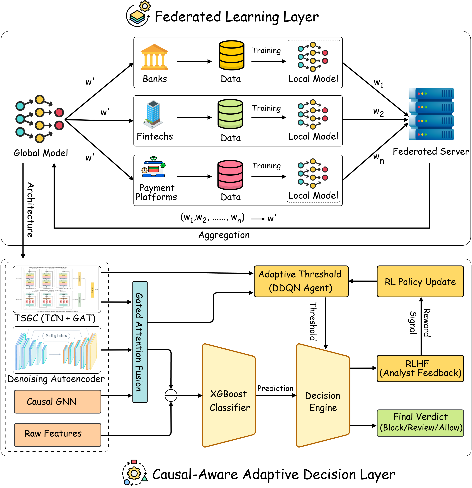

# U-FIN: Federated Heterogeneous-Encoder Fusion with RL-Adaptive Thresholding for Financial Fraud Detection

U-FIN is a research prototype for financial fraud detection on the IEEE-CIS Fraud Detection dataset. The framework combines temporal, relational, causal, and distributional transaction evidence through a heterogeneous multi-encoder architecture, fuses the learned representations with Gated Attention Fusion, and uses an XGBoost meta-learner for final fraud classification. The project also evaluates the system under a simulated federated multi-institution setting and studies DDQN-based adaptive thresholding under delayed feedback.

The repository is organized to support the paper results, reviewer validation, and future reproducibility.



## Highlights

- **Unified multi-encoder fraud model:** TCN, GAT, CaT-GNN, and DAE learn complementary transaction representations.
- **Gated Attention Fusion:** per-sample gate weights combine temporal, graph, causal, and anomaly signals into a 64-dimensional fused embedding.
- **XGBoost meta-learner:** the fused embedding is appended to the original tabular features for final classification.
- **Federated evaluation:** FedAvg+FedBN is evaluated on a simulated three-client non-IID split over unique `card1` values.
- **DDQN threshold control:** adaptive thresholding is studied under delayed feedback and compared against static threshold sweeps.

## Architecture Overview

U-FIN contains four parallel encoders:

| Component | Signal Captured | Output |
|---|---|---|
| FraudTCN | temporal transaction behaviour and velocity patterns | 64-d embedding |
| FraudGAT | relational graph structure across shared cards, devices, emails, and identities | 64-d embedding |
| CaT-GNN | causal-temporal graph evidence and robustness to spurious correlations | 64-d embedding |
| ImprovedDAE | distributional anomaly signal learned from benign transactions | 64-d embedding |

The four embeddings are projected into a common fusion space and combined by a neural gating network. The resulting Gated Attention Fusion embedding is concatenated with the original tabular features and passed to XGBoost for the final fraud probability.

For a detailed explanation of the model design, see [`docs/ARCHITECTURE.md`](docs/ARCHITECTURE.md).

## Main Results

### Centralized, Federated, and Local-Only Comparison

| Setting | AUC | F1 | Precision | Recall |
|---|---:|---:|---:|---:|
| Centralized U-FIN | 0.9637 | 0.7880 | 0.8568 | 0.7295 |
| Federated FedAvg+FedBN | 0.9290 | 0.5966 | 0.7118 | 0.5134 |
| Local-only mean | 0.8044 | 0.2760 | 0.2630 | 0.2911 |

The centralized model is treated as the pooled-data upper bound. The federated experiment uses a simulated non-IID three-client split because IEEE-CIS does not provide real institution identifiers. FedAvg+FedBN improves over local-only training by **12.45 AUC points**, retains **96.39%** of centralized AUC, and shares only model updates rather than pooled raw transaction data.

Canonical result files:

- Centralized fusion: [`results/centralized/results_final_fusion_valSet/metrics/fusion_metrics.json`](results/centralized/results_final_fusion_valSet/metrics/fusion_metrics.json)
- Federated FedAvg+FedBN: [`results/federated/exp1_final/metrics/fl_final_metrics.json`](results/federated/exp1_final/metrics/fl_final_metrics.json)
- Local-only baseline: [`results/federated/exp1_final/local_only/metrics/summary.json`](results/federated/exp1_final/local_only/metrics/summary.json)

### DDQN Threshold-Control Comparison

The DDQN module adjusts the decision threshold over frozen XGBoost scores. The static-threshold ablation is included to separate threshold calibration effects from the adaptive DDQN policy.

| Method | Threshold | FNR | F2 | Caught value |
|---|---:|---:|---:|---:|
| XGBoost static | 0.868 | 0.8304 | 0.2028 | \$84,539 |
| Static threshold | 0.500 | 0.5921 | 0.4540 | \$246,355 |
| DDQN adaptive | 0.500 | 0.5686 | 0.4753 | \$265,059 |
| Static oracle sweep | 0.300 | 0.4955 | 0.5420 | \$312,698 |

`Caught value` is the sum of `TransactionAmt` for fraudulent validation transactions flagged or escalated by the policy. It is a dataset-level proxy, not real-world recovered revenue.

Canonical files:

- DDQN report: [`results/rlhf/Readme.md`](results/rlhf/Readme.md)
- Static threshold comparison: [`results/rlhf/metrics/static_threshold_comparison.json`](results/rlhf/metrics/static_threshold_comparison.json)
- Static threshold figure: [`results/rlhf/figures/static_threshold_comparison.png`](results/rlhf/figures/static_threshold_comparison.png)

## Repository Structure

```text
IES_Challenge_UFIN/
├── assets/
│   └── figures/                  # architecture and supporting figures
├── docs/                         # architecture and federated-learning notes
├── notebooks/
│   ├── final/                    # final experiment notebooks
│   │   └── RLHF/                 # DDQN scripts and threshold comparison
│   ├── eda/                      # exploratory analysis notebooks
│   └── legacy/                   # earlier baseline notebooks
├── models/                       # trained model artifacts and scalers
│   ├── centralized/              # TCN, GAT, CaT-GNN, DAE, fusion/XGBoost
│   ├── federated/                # FedAvg+FedBN and local-only pipelines
│   └── rlhf/                     # DDQN policy model
├── results/
│   ├── centralized/              # TCN, GAT, CaT-GNN, DAE, and fusion outputs
│   ├── federated/exp1_final/     # canonical FedAvg+FedBN experiment outputs
│   └── rlhf/                     # DDQN and static-threshold outputs
```

## Dataset

This project uses the IEEE-CIS Fraud Detection dataset from Kaggle. The dataset is not redistributed here. If you want to rerun the notebooks locally, create a `data/` folder at the repository root and place the files there using the original filenames:

```text
data/
├── train_transaction.csv
├── train_identity.csv
├── test_transaction.csv
├── test_identity.csv
└── sample_submission.csv
```

The experiments use `TransactionDT` for time-aware splitting and preserve the native class imbalance of the dataset. The validation split contains 118,108 samples.

## Environment

The notebooks were developed in a Python notebook environment with the following main libraries:

- Python 3.x
- NumPy, pandas, scikit-learn
- PyTorch
- TensorFlow/Keras
- XGBoost
- Matplotlib, seaborn
- Jupyter Notebook or JupyterLab

A minimal local setup can be created with:

```bash
python -m venv .venv
.\.venv\Scripts\activate
pip install numpy pandas scikit-learn matplotlib seaborn jupyter xgboost torch tensorflow
```

Graph-library installation can vary by CUDA/CPU environment, so install the graph backend required by the GAT/CaT-GNN notebooks according to your local setup.

## Reproducing the Experiments

The final notebooks are organized in the approximate execution order below. Some notebooks load artifacts produced by previous stages, so running them in sequence is recommended.

1. `notebooks/final/experimnet_tcn.ipynb`
2. `notebooks/final/experiment_gat.ipynb`
3. `notebooks/final/experiment_catgnn.ipynb`
4. `notebooks/final/experiment_dae.ipynb`
5. `notebooks/final/experiment_fusion.ipynb`
6. `notebooks/final/experiment_federated.ipynb`
7. `notebooks/final/RLHF/experiment_rlhf.py`
8. `notebooks/final/RLHF/static_threshold_comparison.py`

The final federated result used in the paper is stored under:

```text
results/federated/exp1_final/
```

The final centralized fusion result used in the paper is stored under:

```text
results/centralized/results_final_fusion_valSet/
```

## Paper-Ready Figures

The available architecture and supporting figures are stored in [`assets/figures`](assets/figures). Additional experiment figures are stored next to their corresponding outputs under `results/`.

- Final architecture: `assets/figures/Final_Architecture.png`
- Gate weights: `assets/figures/fig_gate_weights.png`
- DAE reconstruction: `assets/figures/fig_dae_reconstruction.png`
- Fusion analysis: `results/centralized/results_final_fusion_valSet/figures/fusion_analysis.png`
- XGBoost evaluation: `results/centralized/results_final_fusion_valSet/figures/xgb_evaluation_plots.png`
- RLHF comparison: `results/rlhf/figures/rlhf_evaluation.png`
- RLHF threshold trajectory: `results/rlhf/figures/threshold_trajectory.png`

## Federated Learning Notes

The federated setup is a simulated multi-institutional evaluation. Since IEEE-CIS does not contain real institution IDs, unique `card1` values are partitioned into three disjoint clients. This keeps transactions sharing the same card identifier within one simulated institution and creates a card-based non-IID split.

FedAvg+FedBN is used as the canonical FL result. FedAvg performs sample-weighted aggregation of shared parameters, while FedBN keeps BatchNorm statistics local to reduce the effect of heterogeneous client distributions.

## DDQN Notes

The DDQN layer is a threshold controller, not a score generator. It operates on frozen XGBoost fraud scores and adjusts the decision threshold under delayed feedback. The reviewer-safe interpretation is:

- Static threshold lowering explains most of the FNR improvement.
- DDQN provides an additional adaptive gain at the same operating point.
- DDQN is useful as a closed-loop controller when labels arrive with delay and score distributions may drift.

## Citation

If you use this repository, please cite the associated paper. A BibTeX entry can be added here after publication.

```bibtex
@article{ufin2026,
  title  = {U-FIN: Federated Heterogeneous-Encoder Fusion with RL-Adaptive Thresholding for Financial Fraud Detection},
  author = {Sorathiya, Jenish and Patel, Krish and Patel, Jainee and Patel, Banshari and Pandya, Aayush and Trivedi, Himani},
  year   = {2026},
  note   = {Manuscript under review}
}
```

## License

This repository is intended for academic research. Add a formal license file before public release if the code or artifacts are to be reused by others.
